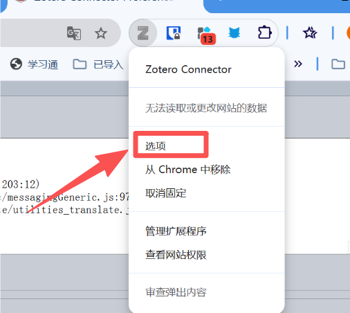
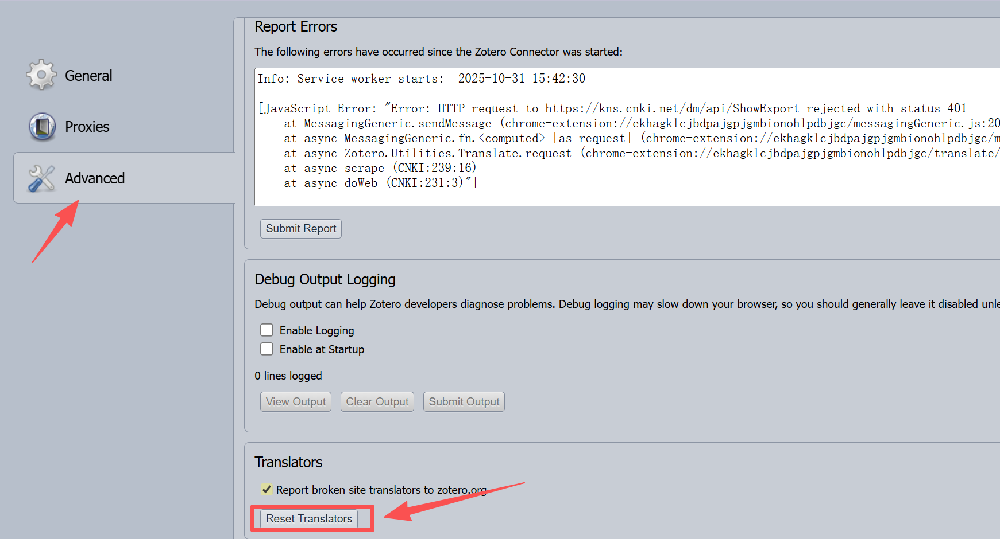

使用Zotero网页插件保存知网文献时总是报错?本文教你如何解决这个问题。

<!--more-->

## 问题描述

使用Zotero网页插件保存文献一直报错:

> 使用 CNKI 保存时发生错误。改为尝试用 DOI 保存。 使用 DOI 保存时发生错误。改为尝试用 Save as Webpage 保存。

## 解决方案

只需要刷新三个设置即可解决!

### 1. 更新Zotero内置转换器

进入 `Zotero设置 > 高级 > 杂项 >自动转换器及样式的更新 >立即更新`

### 2. 更新茉莉花插件的中文转换器

进入 `Zotero设置 > 茉莉花 > 中文转换器设置 > 自动更新转换器 > 立即更新`

### 3. 重置浏览器扩展的转换器

**步骤 A**: 打开浏览器扩展选项

在Chrome浏览器扩展栏 `右键Zotero Connector扩展图标 > 选项`

**步骤 B**: 重置转换器

在选项设置页面中 `Advanced > Translators > Reset Translators`

## 注意事项

- 完成第2步后建议重启浏览器和Zotero
- 如果完成3步还不行,可以尝试:
  - 重启Zotero和浏览器
  - 重复第3步操作

就OK了!现在应该可以正常保存知网文献了。

‍
